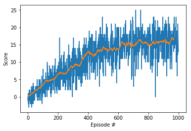

# Project 1: Navigation

### Introduction

The goal of this project is to train agent such that it can collect only yellow bananas in the given square world.

### Environment and Implementation

A reward of +1 is provided for collecting a yellow banana, and a reward of -1 is provided for collecting a blue banana.  Thus, the goal of your agent is to collect as many yellow bananas as possible while avoiding blue bananas.  

The state space has 37 dimensions and contains the agent's velocity, along with ray-based perception of objects around agent's forward direction.  Given this information, the agent has to learn how to best select actions.  Four discrete actions are available, corresponding to:
- **`0`** - move forward.
- **`1`** - move backward.
- **`2`** - turn left.
- **`3`** - turn right.

The agent for navigation was trained on a DQN network which took states(37) as input and gave the Q value for the given state.
The network was implemented in pytorch with the inspiration from  the lunar module project.
 
### Hyperparameters

Hyperparameter | Value
--- | ---    
batch_size | 64
Learning rate | 5e-4
gamma | 0.99
tau | 1e-3
update_every | 4

### Network Description

```python
class QNetwork(nn.Module):
    """Actor (Policy) Model."""

    def __init__(self, state_size, action_size, seed, fc1_units=64, fc2_units=64):
        """Initialize parameters and build model.
        Params
        ======
            state_size (int): Dimension of each state
            action_size (int): Dimension of each action
            seed (int): Random seed
            fc1_units (int): Number of nodes in first hidden layer
            fc2_units (int): Number of nodes in second hidden layer
        """
        super(QNetwork, self).__init__()
        self.seed = torch.manual_seed(seed)
        self.fc1 = nn.Linear(state_size, fc1_units)
        self.fc2 = nn.Linear(fc1_units, fc2_units)
        self.fc3 = nn.Linear(fc2_units, action_size)

    def forward(self, state):
        """Build a network that maps state -> action values."""
        x = F.relu(self.fc1(state))
        x = F.relu(self.fc2(x))
        return self.fc3(x)
```

### Results
Training was run for a total of 1000 episodes.

In the figure below
* Blue Lines denote the "Raw scores" which are the unfiltered final reward at each episode, which is noisy
* Yellow Line denote the "Average scores" which are the same scores, but smoothed out with a 100-episode moving average.



The `model.pth` file contains the trained weights.

### Future Work

Implementation of the same environment can be done by pixels i.e pushing the frames of the screen in a DQN which is essentially a CNN.
